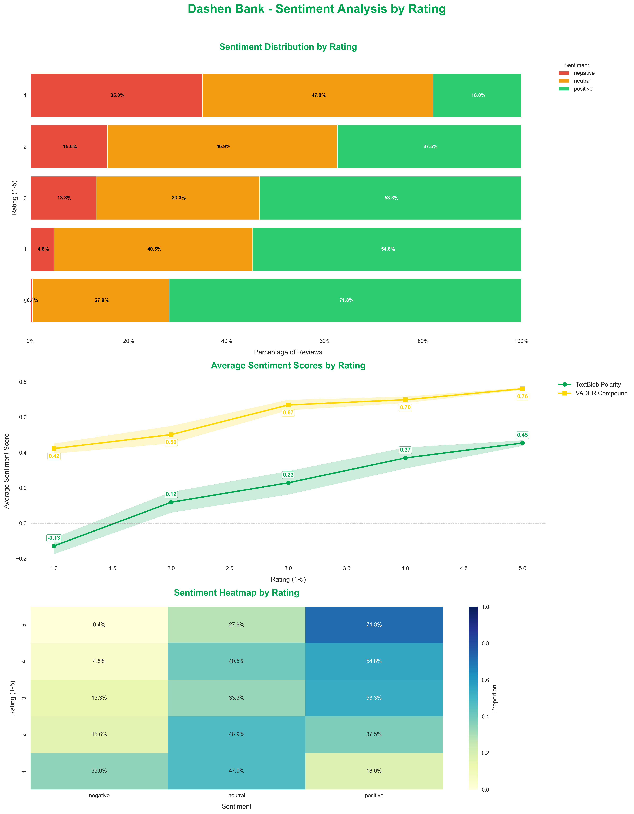
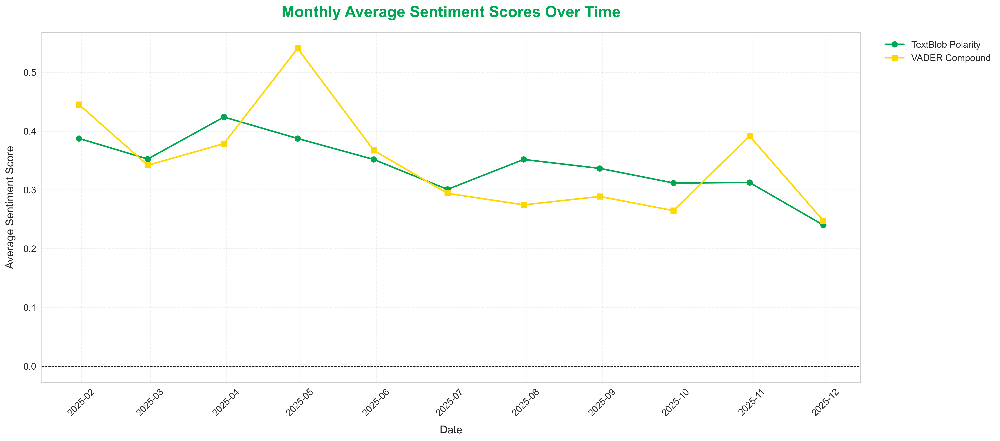

# Dashen Bank Sentiment Analysis Report

## Overview
This report summarizes the sentiment analysis of 753 Dashen Bank reviews.

## Key Statistics
- **Total Reviews**: 753
- **Date Range**: 2025-01-11 to 2025-11-27

## Sentiment Analysis

### TextBlob Analysis
- Positive: 463 (61.5%)
- Neutral: 242 (32.1%)
- Negative: 48 (6.4%)

### VADER Analysis
- Positive: 727 (96.5%)
- Neutral: 23 (3.1%)
- Negative: 3 (0.4%)

## Rating Distribution
- 1★: 100 (13.3%)
- 2★: 32 (4.2%)
- 3★: 30 (4.0%)
- 4★: 42 (5.6%)
- 5★: 549 (72.9%)

## Visualizations

---

*Report generated on: 2025-11-30 21:43:48*
